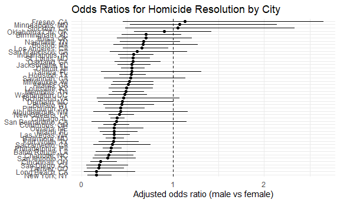

HW6
================

# Problem 1

### Create variable & tidy data:

``` r
homicide_df = 
  read_csv("data/homicide-data.csv") %>% 
  mutate(
    city_state = str_c(city, ", ", state),
    resolved = disposition != "Open/No arrest",
    victim_age = as.numeric(victim_age)
  ) %>% 
  filter(
    !city_state %in% c("Dallas, TX", "Phoenix, AZ", 
                       "Kansas City, MO", "Tulsa, AL"),
    victim_race %in% c("White", "Black")
  )
```

    ## Rows: 52179 Columns: 12
    ## ── Column specification ────────────────────────────────────────────────────────
    ## Delimiter: ","
    ## chr (9): uid, victim_last, victim_first, victim_race, victim_age, victim_sex...
    ## dbl (3): reported_date, lat, lon
    ## 
    ## ℹ Use `spec()` to retrieve the full column specification for this data.
    ## ℹ Specify the column types or set `show_col_types = FALSE` to quiet this message.

### Try to fit a logistic regression for Baltimore:

``` r
baltimore_df = 
  homicide_df %>% 
  filter(city_state == "Baltimore, MD") %>% 
  mutate(
    victim_sex  = fct_relevel(victim_sex, "Female"),
    victim_race = fct_relevel(victim_race, "White")
  )

baltimore_fit = 
  baltimore_df %>% 
  glm(
    resolved ~ victim_age + victim_sex + victim_race,
    data   = .,
    family = binomial()
  )

baltimore_or =
  baltimore_fit %>% 
  tidy(conf.int = TRUE, exponentiate = TRUE) %>% 
  filter(term == "victim_sexMale") %>% 
  select(term, estimate, conf.low, conf.high)

baltimore_or
```

    ## # A tibble: 1 × 4
    ##   term           estimate conf.low conf.high
    ##   <chr>             <dbl>    <dbl>     <dbl>
    ## 1 victim_sexMale    0.355    0.267     0.468

### Apply the model to other cities:

``` r
model_df = 
  homicide_df %>% 
  mutate(
    victim_sex  = fct_relevel(victim_sex, "Female"),
    victim_race = fct_relevel(victim_race, "White")
  )

city_or_df = 
  model_df %>% 
  nest(data = -city_state) %>% 
  mutate(
    fit = map(
      data,
      ~ glm(
          resolved ~ victim_age + victim_sex + victim_race,
          data   = .x,
          family = binomial()
        )
    ),
    tidy_res = map(
      fit,
      ~ tidy(.x, conf.int = TRUE, exponentiate = TRUE)
    )
  ) %>% 
  select(city_state, tidy_res) %>% 
  unnest(tidy_res) %>% 
  filter(term == "victim_sexMale") %>% 
  mutate(
    city_state = fct_reorder(city_state, estimate)
  )

city_or_df %>% head()
```

    ## # A tibble: 6 × 8
    ##   city_state      term  estimate std.error statistic  p.value conf.low conf.high
    ##   <fct>           <chr>    <dbl>     <dbl>     <dbl>    <dbl>    <dbl>     <dbl>
    ## 1 Albuquerque, NM vict…    0.430     0.546     -1.55 1.22e- 1    0.132     1.16 
    ## 2 Atlanta, GA     vict…    0.512     0.227     -2.95 3.22e- 3    0.323     0.789
    ## 3 Baltimore, MD   vict…    0.355     0.143     -7.26 3.74e-13    0.267     0.468
    ## 4 Baton Rouge, LA vict…    0.319     0.333     -3.44 5.87e- 4    0.160     0.596
    ## 5 Birmingham, AL  vict…    0.704     0.229     -1.53 1.25e- 1    0.444     1.09 
    ## 6 Boston, MA      vict…    0.674     0.326     -1.21 2.26e- 1    0.353     1.28

### Creat a plot:

``` r
city_or_plot = 
  city_or_df %>% 
  mutate(
    city_state = fct_reorder(city_state, estimate)
  ) %>% 
  ggplot(aes(x = estimate, y = city_state)) +
  geom_point() +
  geom_errorbarh(aes(xmin = conf.low, xmax = conf.high), height = 0) +
  geom_vline(xintercept = 1, linetype = "dashed") +
  labs(
    title = "Odds Ratios for Homicide Resolution by City",
    x = "Adjusted odds ratio (male vs female)",
    y = NULL
  )

city_or_plot
```



Across all cities, only Fresno, Minneapolis, and Stockton had OR
estimates exceeding 1. The point estimates for all other cities were
below 1, and over half of the cities had confidence intervals entirely
on the left side of 1. This indicates that, controlling for age and
race, homicides with male victims generally tend to be less likely to be
resolved than homicides with female victims.
