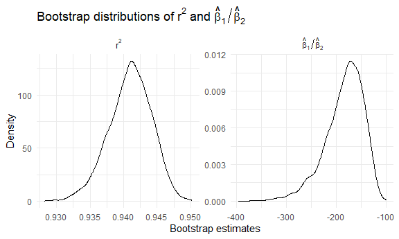
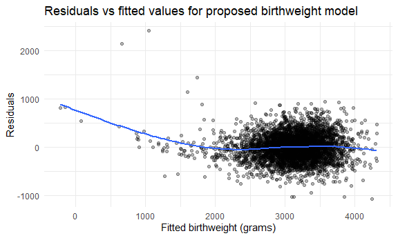
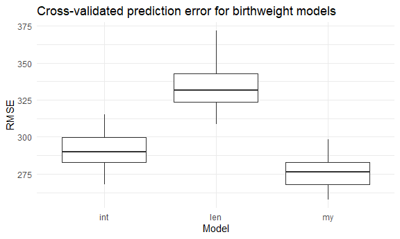

HW6
================

``` r
library(tidyverse)
library(broom)
library(forcats)
library(purrr)
library(modelr)

knitr::opts_chunk$set(
    echo = TRUE,
    warning = FALSE,
  fig.width = 6,
  fig.asp = .6,
  out.width = "90%"
)

theme_set(theme_minimal() + theme(legend.position = "bottom"))

options(
  ggplot2.continuous.colour = "viridis",
  ggplot2.continuous.fill = "viridis"
)

scale_colour_discrete = scale_colour_viridis_d
scale_fill_discrete = scale_fill_viridis_d
```

## Problem 1

### Create variable & tidy data:

``` r
homicide_df = 
  read_csv("data/homicide-data.csv") %>% 
  mutate(
    city_state = str_c(city, ", ", state),
    resolved = disposition != "Open/No arrest",
    victim_age = as.numeric(victim_age)
  ) %>% 
  filter(
    !city_state %in% c("Dallas, TX", "Phoenix, AZ", 
                       "Kansas City, MO", "Tulsa, AL"),
    victim_race %in% c("White", "Black")
  )
```

    ## Rows: 52179 Columns: 12
    ## ── Column specification ────────────────────────────────────────────────────────
    ## Delimiter: ","
    ## chr (9): uid, victim_last, victim_first, victim_race, victim_age, victim_sex...
    ## dbl (3): reported_date, lat, lon
    ## 
    ## ℹ Use `spec()` to retrieve the full column specification for this data.
    ## ℹ Specify the column types or set `show_col_types = FALSE` to quiet this message.

### Try to fit a logistic regression for Baltimore:

``` r
baltimore_df = 
  homicide_df %>% 
  filter(city_state == "Baltimore, MD") %>% 
  mutate(
    victim_sex  = fct_relevel(victim_sex, "Female"),
    victim_race = fct_relevel(victim_race, "White")
  )

baltimore_fit = 
  baltimore_df %>% 
  glm(
    resolved ~ victim_age + victim_sex + victim_race,
    data   = .,
    family = binomial()
  )

baltimore_or =
  baltimore_fit %>% 
  tidy(conf.int = TRUE, exponentiate = TRUE) %>% 
  filter(term == "victim_sexMale") %>% 
  select(term, estimate, conf.low, conf.high)

baltimore_or
```

    ## # A tibble: 1 × 4
    ##   term           estimate conf.low conf.high
    ##   <chr>             <dbl>    <dbl>     <dbl>
    ## 1 victim_sexMale    0.355    0.267     0.468

### Apply the model to other cities:

``` r
model_df = 
  homicide_df %>% 
  mutate(
    victim_sex  = fct_relevel(victim_sex, "Female"),
    victim_race = fct_relevel(victim_race, "White")
  )

city_or_df = 
  model_df %>% 
  nest(data = -city_state) %>% 
  mutate(
    fit = map(
      data,
      ~ glm(
          resolved ~ victim_age + victim_sex + victim_race,
          data   = .x,
          family = binomial()
        )
    ),
    tidy_res = map(
      fit,
      ~ tidy(.x, conf.int = TRUE, exponentiate = TRUE)
    )
  ) %>% 
  select(city_state, tidy_res) %>% 
  unnest(tidy_res) %>% 
  filter(term == "victim_sexMale") %>% 
  mutate(
    city_state = fct_reorder(city_state, estimate)
  )

city_or_df %>% head()
```

    ## # A tibble: 6 × 8
    ##   city_state      term  estimate std.error statistic  p.value conf.low conf.high
    ##   <fct>           <chr>    <dbl>     <dbl>     <dbl>    <dbl>    <dbl>     <dbl>
    ## 1 Albuquerque, NM vict…    0.430     0.546     -1.55 1.22e- 1    0.132     1.16 
    ## 2 Atlanta, GA     vict…    0.512     0.227     -2.95 3.22e- 3    0.323     0.789
    ## 3 Baltimore, MD   vict…    0.355     0.143     -7.26 3.74e-13    0.267     0.468
    ## 4 Baton Rouge, LA vict…    0.319     0.333     -3.44 5.87e- 4    0.160     0.596
    ## 5 Birmingham, AL  vict…    0.704     0.229     -1.53 1.25e- 1    0.444     1.09 
    ## 6 Boston, MA      vict…    0.674     0.326     -1.21 2.26e- 1    0.353     1.28

### Creat a plot:

``` r
city_or_plot = 
  city_or_df %>% 
  mutate(
    city_state = fct_reorder(city_state, estimate)
  ) %>% 
  ggplot(aes(x = estimate, y = city_state)) +
  geom_point() +
  geom_errorbarh(aes(xmin = conf.low, xmax = conf.high), height = 0) +
  geom_vline(xintercept = 1, linetype = "dashed") +
  labs(
    title = "Odds Ratios for Homicide Resolution by City",
    x = "Adjusted odds ratio (male vs female)",
    y = NULL
  ) +
  theme(
    axis.text.y = element_text(size = 6),
  )

city_or_plot
```


Across all cities, only Fresno, Minneapolis, and Stockton had OR
estimates exceeding 1. The point estimates for all other cities were
below 1, and over half of the cities had confidence intervals entirely
on the left side of 1. This indicates that, controlling for age and
race, homicides with male victims generally tend to be less likely to be
resolved than homicides with female victims.

## Problem 2

``` r
library(p8105.datasets)
data("weather_df")
```

### Estimates of two quantities:

``` r
weather_df_clean = 
  weather_df %>% 
  drop_na(tmax, tmin, prcp)

weather_fit = 
  weather_df_clean %>% 
  lm(tmax ~ tmin + prcp, data = .)

weather_fit %>% 
  glance() %>% 
  select(r.squared)
```

    ## # A tibble: 1 × 1
    ##   r.squared
    ##       <dbl>
    ## 1     0.941

``` r
beta_ratio =
  weather_fit %>% 
  tidy() %>% 
  filter(term %in% c("tmin", "prcp")) %>% 
  select(term, estimate) %>% 
  pivot_wider(names_from = term, values_from = estimate) %>% 
  mutate(beta_ratio = tmin / prcp) %>% 
  pull(beta_ratio)

beta_ratio
```

    ## [1] -182.4002

``` r
set.seed(8105)

boot_results = 
  weather_df_clean %>% 
  modelr::bootstrap(n = 5000) %>%
  mutate(
    df   = map(strap, as_tibble),
    fit  = map(df, ~ lm(tmax ~ tmin + prcp, data = .x)),
    gln  = map(fit, glance),
    tdy  = map(fit, tidy),
    r_squared = map_dbl(gln, "r.squared"),
    beta_ratio = map_dbl(
      tdy,
      ~ .x %>% 
        filter(term %in% c("tmin", "prcp")) %>% 
        select(term, estimate) %>% 
        pivot_wider(names_from = term, values_from = estimate) %>% 
        summarise(beta_ratio = tmin / prcp) %>% 
        pull(beta_ratio)
    )
  ) %>% 
  select(.id, r_squared, beta_ratio)
```

### Plot distribution:

``` r
boot_long = 
  boot_results %>% 
  pivot_longer(
    cols = c(r_squared, beta_ratio),
    names_to = "parameter",
    values_to = "estimate"
  ) %>% 
  mutate(
    parameter = recode(
      parameter,
      r_squared  = "r^2",
      beta_ratio = "hat(beta)[1] / hat(beta)[2]"
    ),
    parameter = factor(
      parameter,
      levels = c("r^2", "hat(beta)[1] / hat(beta)[2]")
    )
  )

boot_long %>% 
  ggplot(aes(x = estimate)) +
  geom_density() +
  facet_wrap(~ parameter, 
             scales = "free",
             labeller = label_parsed) +
  labs(
    title = expression(
      paste("Bootstrap distributions of ", r^2, " and ", hat(beta)[1] / hat(beta)[2])
    ),
    x = "Bootstrap estimates",
    y = "Density"
  )
```



The bootstrap distribution of $r^2$ is unimodal and approximately
symmetric, concentrated in a narrow range around 0.94. This suggests
that the proportion of variation in $tmax$ explained by the model is
fairly stable across resamples and is estimated with high precision. In
contrast, the bootstrap distribution of $\hat{\beta}_1 / \hat{\beta}_2$
is much more spread out and somewhat skewed toward large negative
values. This indicates substantial uncertainty in the ratio of the
coefficients for $tmin$ and $prcp$, meaning that the relative importance
of these two predictors is estimated much less precisely than the
overall model fit.

### 95% CI interval:

``` r
boot_ci = 
  boot_results %>% 
  summarise(
    r2_low     = quantile(r_squared, 0.025),
    r2_high    = quantile(r_squared, 0.975),
    ratio_low  = quantile(beta_ratio, 0.025),
    ratio_high = quantile(beta_ratio, 0.975)
  )

boot_ci
```

    ## # A tibble: 1 × 4
    ##   r2_low r2_high ratio_low ratio_high
    ##    <dbl>   <dbl>     <dbl>      <dbl>
    ## 1  0.934   0.947     -277.      -125.

Based on the 5000 bootstrap estimates, the 95% confidence interval for
$r^2$ is \[0.934, 0.947\], and the 95% confidence interval for
$\hat{\beta}_1 / \hat{\beta}_2$ is \[-277, -125\].

## Problem 3

### Clean data:

``` r
birthweight_df = 
  read_csv("data/birthweight.csv") %>%
  janitor::clean_names() %>% 
  mutate(
    babysex = factor(
      babysex,
      levels = c(1, 2),
      labels = c("male", "female")
    ),
    frace = factor(
      frace,
      levels = c(1, 2, 3, 4, 8, 9),
      labels = c("White", "Black", "Asian", "Puerto Rican", "Other", "Unknown")
    ),
    mrace = factor(
      mrace,
      levels = c(1, 2, 3, 4, 8),
      labels = c("White", "Black", "Asian", "Puerto Rican", "Other")
    ),
    malform = factor(
      malform,
      levels = c(0, 1),
      labels = c("absent", "present")
    )
  )
```

    ## Rows: 4342 Columns: 20
    ## ── Column specification ────────────────────────────────────────────────────────
    ## Delimiter: ","
    ## dbl (20): babysex, bhead, blength, bwt, delwt, fincome, frace, gaweeks, malf...
    ## 
    ## ℹ Use `spec()` to retrieve the full column specification for this data.
    ## ℹ Specify the column types or set `show_col_types = FALSE` to quiet this message.

``` r
birthweight_df %>% 
  summarise(n_missing = sum(is.na(across(everything()))))
```

    ## # A tibble: 1 × 1
    ##   n_missing
    ##       <int>
    ## 1         0

### Regression model:

``` r
birthweight_fit = 
  birthweight_df %>% 
  lm(
    bwt ~ babysex + bhead + blength + gaweeks +
      ppbmi + wtgain + smoken + fincome +
      mrace + malform,
    data = .
  )

birthweight_df %>% 
  add_residuals(birthweight_fit) %>% 
  add_predictions(birthweight_fit) %>% 
  ggplot(aes(x = pred, y = resid)) +
  geom_point(alpha = 0.3) +
  geom_smooth(se = FALSE) +
  labs(
    x = "Fitted birthweight (grams)",
    y = "Residuals",
    title = "Residuals vs fitted values for proposed birthweight model"
  )
```

    ## `geom_smooth()` using method = 'gam' and formula = 'y ~ s(x, bs = "cs")'


I fit a multiple linear regression model with birthweight as the outcome
and included baby’s head circumference, length at birth, gestational
age, baby’s sex, maternal pre-pregnancy BMI, maternal weight gain,
smoking during pregnancy, family income, maternal race, and
malformations as predictors. To assess model fit, I plotted residuals
versus fitted values using `add_predictions` and `add_residuals`.

### Make comparison:

``` r
bw_formula = 
  bwt ~ babysex + bhead + blength + gaweeks +
    ppbmi + wtgain + smoken + fincome +
    mrace + malform

set.seed(8105)

cv_df = 
  modelr::crossv_mc(birthweight_df, n = 100) %>% 
  mutate(
    train = map(train, as_tibble),
    test  = map(test,  as_tibble)
  ) %>% 
  mutate(
    fit_my   = map(train, ~lm(bw_formula, data = .x)),
    fit_len  = map(train, ~lm(bwt ~ blength + gaweeks, data = .x)),
    fit_int  = map(train, ~lm(bwt ~ bhead * blength * babysex, data = .x))
  ) %>% 
  mutate(
    rmse_my  = map2_dbl(fit_my,  test, modelr::rmse),
    rmse_len = map2_dbl(fit_len, test, modelr::rmse),
    rmse_int = map2_dbl(fit_int, test, modelr::rmse)
  )

cv_rmse_df = 
  cv_df %>% 
  select(starts_with("rmse")) %>% 
  pivot_longer(
    everything(),
    names_to = "model",
    values_to = "rmse",
    names_prefix = "rmse_"
  )

cv_rmse_df %>% 
  ggplot(aes(x = model, y = rmse)) +
  geom_boxplot() +
  labs(
    x = "Model",
    y = "RMSE",
    title = "Cross-validated prediction error for birthweight models"
  )
```



``` r
cv_rmse_summary = 
  cv_rmse_df %>% 
  group_by(model) %>% 
  summarise(mean_rmse = mean(rmse))

cv_rmse_summary
```

    ## # A tibble: 3 × 2
    ##   model mean_rmse
    ##   <chr>     <dbl>
    ## 1 int        291.
    ## 2 len        334.
    ## 3 my         276.

The mean cross–validated RMSEs were about 276 for my model, 291 for the
interaction model, and 334 for the simple model. This suggests that
including additional clinically motivated predictors improves
out-of-sample prediction more than adding high-order interactions among
a small set of variables.
